# Send-IT UI
SendIT is a courier service that helps users deliver parcels to different destinations. SendIT
provides courier quotes based on weight categories.

This github repository contains HTML pages and elements like CSS, JAVASCRIPT and some Images to make these pages more styled and a bit interactive. 

the finished UI is hosted on github pages and the link is [kabalisa.github.io/Send-IT](https://kabalisa.github.io/Send-IT/)

**Below are the required features for the product and screenshots of the finished UIs:**
* User can view the index page

* User can create an account

**Business account:**

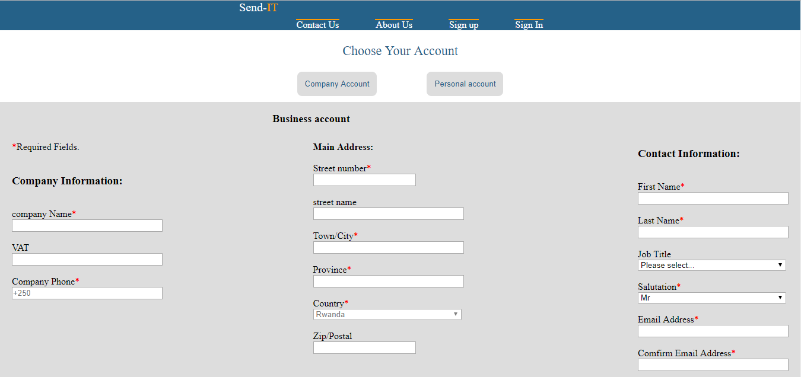
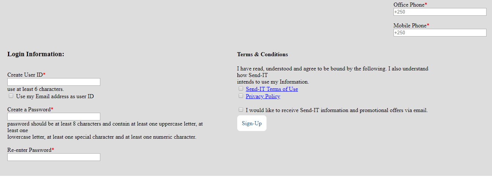

**Personal account:**

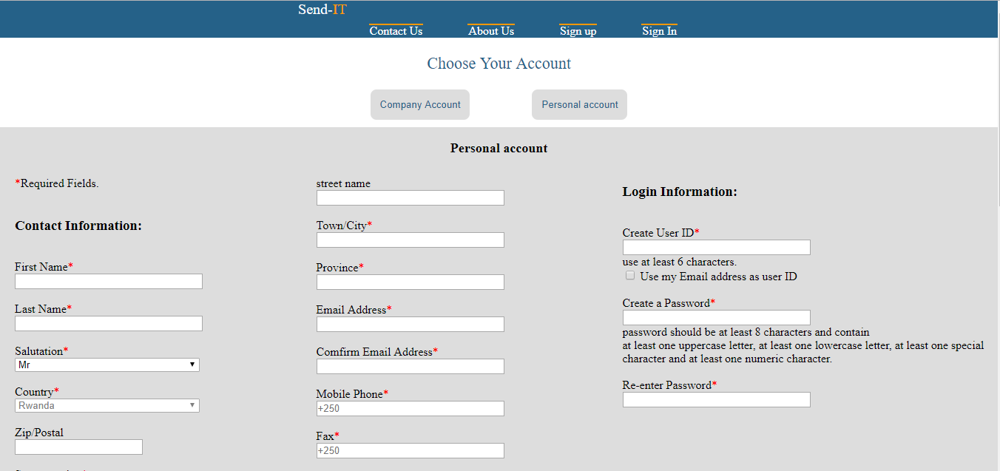
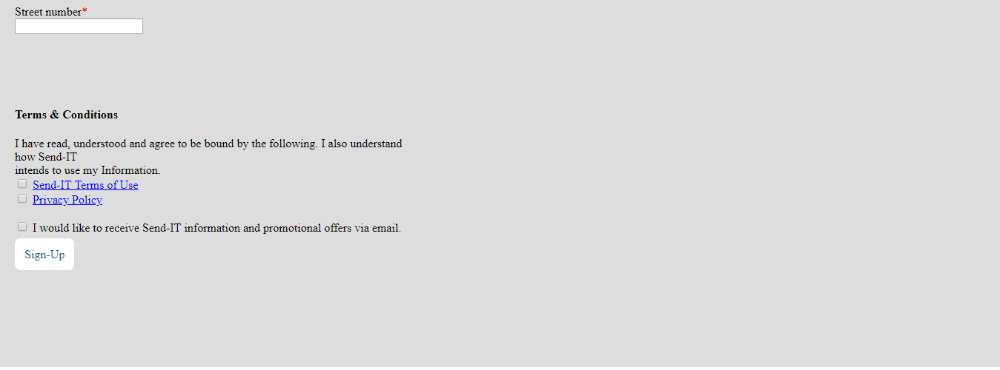

* User can login:

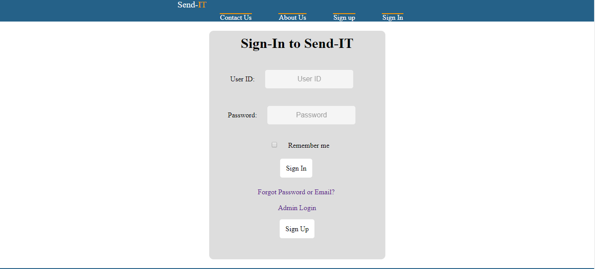

* User can create a parcel:

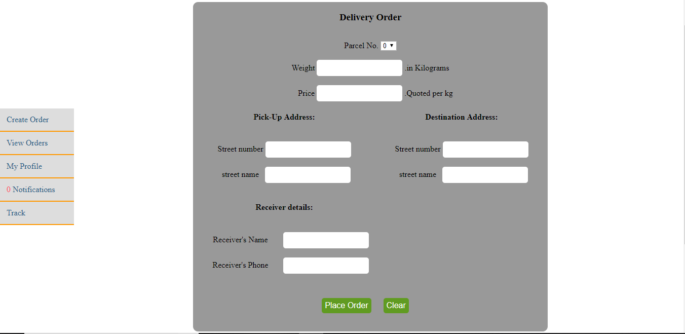

* user can view the orders:

**current orders**

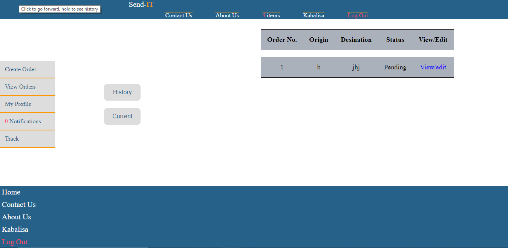

**delivered orders**

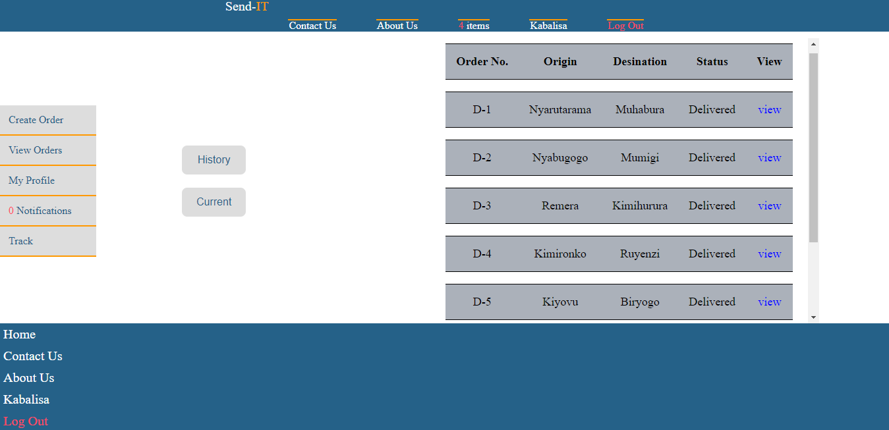

* user can view the details of an order:

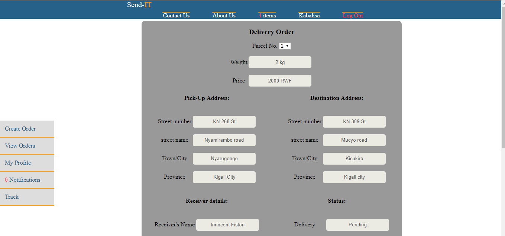

* user can view his/her profile

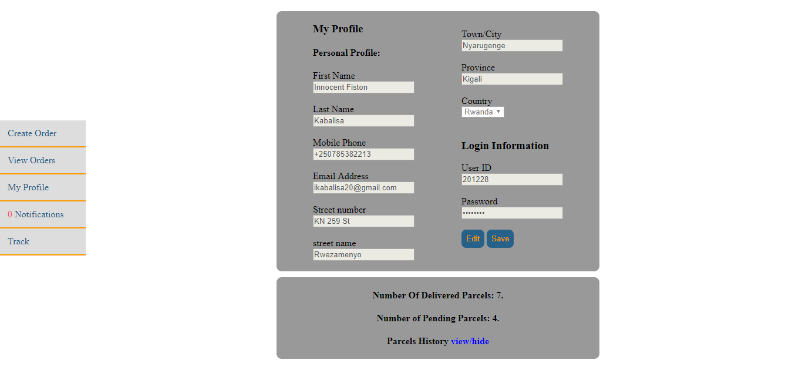
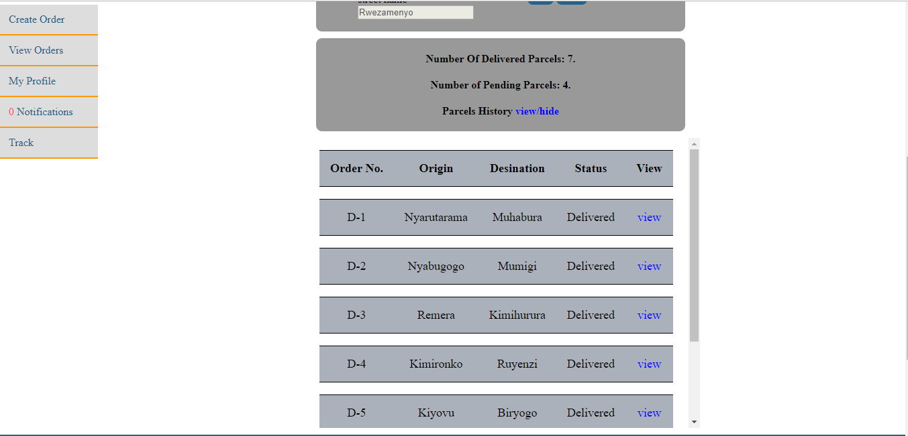

* admin can view his page

**Admin login**

**Admin dashboard**

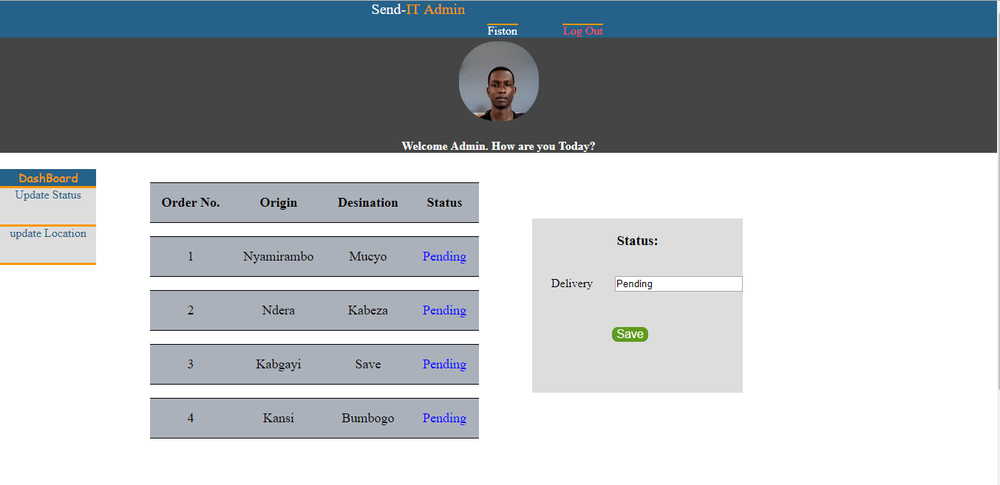

# Author
Kabalisa Innocent Fiston
